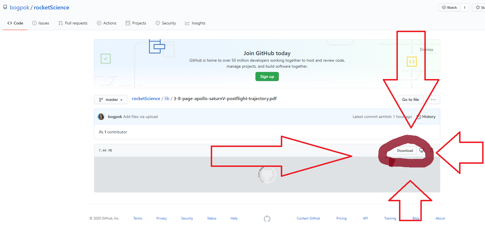

# Сведения по ракетам-носителям

## Релевантная литература

Название | Описание | Файл
---|---|:---:
Gemini VII | Траектория (в том числе и пуска) Gemini VII в таблицах со страницы 4-10 (96).   Подробные циклограммы в таблицах, с указанием времени действий и положения ЛА | [Gemini VII](lib/4-15-page-Gemini-Program-Mission-Report-Gemini-Viii.pdf)
Аполлон | Циклограммы и графики запуска Сатруна 5 со стр. 3-8 (36) | [Apollo / Saturn V](lib/3-8-page-apollo-saturnV-postflight-trajectory.pdf)
Построение траекторий РН КА | Статья с математической моделью (уравнениями движения) ракеты-носителя.   Но я рекомендую считать (если надо) по программе РН от **МС**, которую он давал в маткаде |[Построение траекторий](lib/LV_trajectories.pdf)
Губанов. Триумф и трагедия "Энергии" | Все это *смешно*, но на 5-той странице есть циклограмма подготовки и пуска | [Триумф Губанова и его трагедия](lib/gubanov_cyclogram.pdf)
Самарские ступени "семерки" | Обильно, познавательно, *вкусно* и, может быть, полезно | [Самарские ступени](lib/samarskie_stupeni.pdf "А оно тебе надо?")

### Как скачивать файлы
Можно загружать файлы из папки /lib по отдельности:

Также можно скачать **весь проект** с материалами как архив.

## См. также

По Союзу можно просто видео посмотреть

